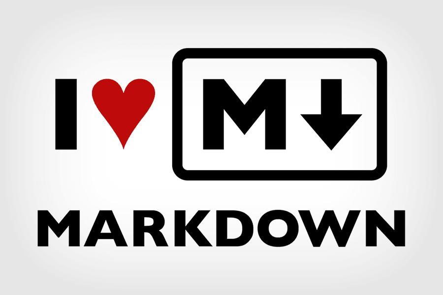

说明：这篇文章用于记录我如何弄清楚在windows环境下使用vscode+mingw+cmake完成跑c++项目
为了达到这个目标，我们首先要解答几个问题：

**Q：什么是vscode？什么是vscode的插件？什么是mingw？什么是cmake？**
【什么是vscode】
vscode只是一个文本编辑器，它并没有跑代码的功能，所以直接下载vscode是不能像visual studio那样跑c++项目的。因此，为了要跑C++项目我们需要将高级语言用编译器翻译成机器码，因此我们的window上需要下载mingw这个编译器。

**而vscode本身的插件并不是编译器，它只是适配这些插件的一些工具而已。因此后面的mingw，cmake都是需要我们自己去官网上下载，然后再用vscode的插件来方便我们使用。**

【什么是mingw，它要怎么下载】
mingw是window上针对C/C++专门的编译器，类似于linux上的gcc。它的下载方式可以参考以下blog，注意要下载二进制的bin的文件，不要下载交叉编译的文件。
参考blog：
https://www.jianshu.com/p/d66c2f2e3537 【如何下载mingw】
https://blog.csdn.net/Spring_Et/article/details/115047076 【为什么下载mingw没有bin】
https://segmentfault.com/a/1190000021898415 【如何配置git的路径】

【vscode提交commit出现问题】
https://stackoverflow.com/questions/72908270/why-commit-editmsg-opens-when-i-try-to-commit-in-vscode 

**cmake是什么？**
由于不同os上的makefile不同，生成这些针对不同操作系统的makefile非常麻烦，因此人们开发了一个工具cmake，专门用来生成makefile文件。它可以根据操作系统，编译器，还有cmakelist.txt中的配置项来生成对应的makefile，但是它本身并不构建可执行文件。
https://blog.csdn.net/xierhacker/article/details/79445339  【最好的科普文章】
https://www.cnblogs.com/ybqjymy/p/13409050.html  【cmake入门案例】

**windows下cmake的安装可参考**
【window 这个可解决】
https://blog.csdn.net/qq_42973562/article/details/101986353?spm=1001.2101.3001.6650.1&utm_medium=distribute.pc_relevant.none-task-blog-2%7Edefault%7ECTRLIST%7Edefault-1-101986353-blog-121437521.pc_relevant_multi_platform_whitelistv2_ad_hc&depth_1-utm_source=distribute.pc_relevant.none-task-blog-2%7Edefault%7ECTRLIST%7Edefault-1-101986353-blog-121437521.pc_relevant_multi_platform_whitelistv2_ad_hc
【cmake的使用】
https://www.jianshu.com/p/70149b2f78c0

####步骤归纳：
1、先要使用cmakelist.txt，生成对应的build/makefile
https://zhuanlan.zhihu.com/p/443414884 【这篇博客说明了cmake是什么？就是用来对不同的编译器生成makefile的，甚至还做了一个gui工具】
然后使用下面的命令（由于编译器不同，这里是mingw，如果linux这个命令可能需要修改）
**cmake -G "MinGW Makefiles" .**

2、基于makefile，进行make，生成对应的可执行文件
由于这里是mingw，因此使用的make命令是
**mingw32-make**
PS C:\Users\tommy\Desktop\test> mingw32-make
[ 50%] Building CXX object CMakeFiles/cmake_test.dir/main.cpp.obj
[100%] Linking CXX executable cmake_test.exe
[100%] Built target cmake_test

3、最终执行可执行文件
PS C:\Users\tommy\Desktop\test> .\cmake_test.exe
Hello, world!
PS C:\Users\tommy\Desktop\test>

#### 关于vscode中添加markdown
【如何在vscode中添加markdown及图片】
https://zhuanlan.zhihu.com/p/412885390 【vscode markdown插件】
https://zhuanlan.zhihu.com/p/113115306 【添加图片方法见评论区】
